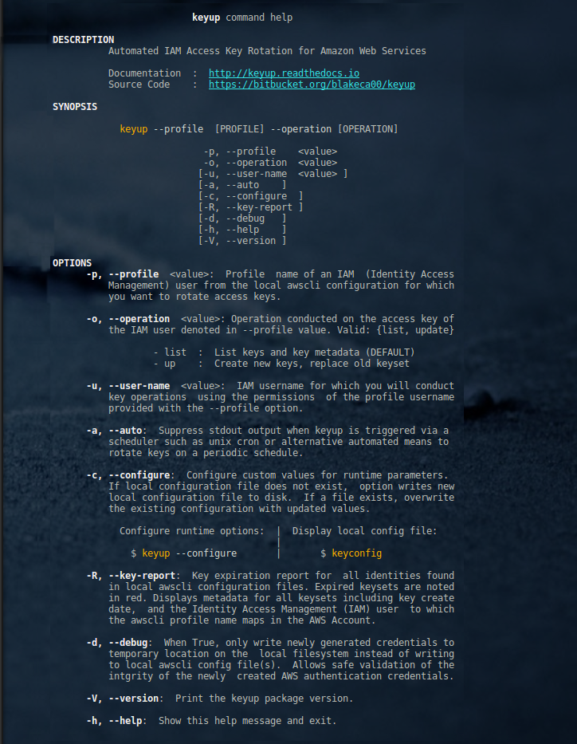

* * *
#   **keyup** |  Automated IAM Access Key Rotation for Amazon Web Services
* * *

Ubuntu 22 (did not test other repos) workaround .....

pyaws has a typo on the setup.py so install the one here manually I sent a pull request but i added a patched tarball here for the time being

```
pip install ./pyaws-0.4.2.tar.gz
```


## About this repository

* Purpose:        keyup automates IAM user access key rotation in Amazon Web Services' Accounts
* Version: 1.3.1
* Documentation:  [https://keyup.readthedocs.io](https://keyup.readthedocs.io)
* Other: This is a fork of https://bitbucket.org/blakeca00/keyup Master branch from 05-28-2023

* * *

## Contents

* [Purpose](#markdown-header-purpose)
* [Getting Started](#markdown-header-getting-started)
* [Documentation](#markdown-header-documentation)
* [Help](#markdown-header-help)
* [Installation](#markdown-header-installation)
* [Author & Copyright](#markdown-header-author-copyright)
* [License](#markdown-header-license)
* [Disclaimer](#markdown-header-disclaimer)

[back to the top](#markdown-header-about-this-repository)

* * *

## Purpose ##

**Keyup**:

* is a safe, error-free mechanism to rotate (renew) access keys to Amazon Web Services as
frequently as you wish, with minimal effort and risk.

* enables you to change your access keys when required by executing a single command from the cli.

* Alternatively, enter a keyup command in your crontab with the ``` --auto ``` parameter and renew access
keys on a daily schedule.

* **keyup** requires only the profile name of your IAM user in your local [awscli configuration](https://docs.aws.amazon.com/cli/latest/reference/):

```bash

    $ keyup  --profile johndoe  --operation up

```

[back to the top](#markdown-header-about-this-repository)

* * *


## Getting Started

Before starting, suggested to read the following:

* [Frequently Asked Questions (FAQ)](http://keyup.readthedocs.io/en/latest/FAQ.html)
* [Installation](http://keyup.readthedocs.io/en/latest/installation.html)
* [Use Cases](http://keyup.readthedocs.io/en/latest/usecases.html)

**keyup** is licensed under [General Public License v3](http://keyup.readthedocs.io/en/latest/license.html)

[back to the top](#markdown-header-about-this-repository)

* * *

## Documentation ##

**Online Documentation**:

* Complete html documentation available at [http://keyup.readthedocs.io](http://keyup.readthedocs.io).

**Download Documentation**:

* [pdf format](https://readthedocs.org/projects/keyup/downloads/pdf/latest/)
* [Amazon Kindle](https://readthedocs.org/projects/keyup/downloads/epub/latest/) (epub) format

[back to the top](#markdown-header-about-this-repository)

* * *

## Help ##

Diplay help menu

```bash

    $ keyup --help

```

[](http://images.awspros.world/keyup/help-menu.png)

[back to the top](#markdown-header-about-this-repository)

* * *
## Installation
* * *

### Installation via pip

**Linux** | Installation via pip:

```bash

    $ pip3 install keyup --user

```

**Windows** (Powershell) | Installation via pip:

```bash

    $ pip3 install keyup

```

[back to the top](#markdown-header-about-this-repository)

* * *

### Installation via Source Code


**Source** | Installation via source code on local machine:

To see make targets, run:

```bash

    $ make help
```


To install locally in a virtualenv:

```bash

    $ make source-install

```

[back to the top](#markdown-header-about-this-repository)

* * *

### Verify Installation (windows & Linux):

```bash

    $ keyup --version

```


[back to the top](#markdown-header-about-this-repository)

* * *

## Author & Copyright

All works contained herein copyrighted via below author unless work is explicitly noted by an alternate author.

* Copyright Blake Huber, All Rights Reserved.

[back to the top](#markdown-header-about-this-repository)

* * *

## License

* Software contained in this repo is licensed under the [GNU General Public License Agreement (GPL-3)](https://bitbucket.org/blakeca00/keyup/src/master/LICENSE.txt).

[back to the top](#markdown-header-about-this-repository)

* * *

## Disclaimer

*Code is provided "as is". No liability is assumed by either the code's originating author nor this repo's owner for their use at AWS or any other facility. Furthermore, running function code at AWS may incur monetary charges; in some cases, charges may be substantial. Charges are the sole responsibility of the account holder executing code obtained from this library.*

Additional terms may be found in the complete [license agreement](https://bitbucket.org/blakeca00/keyup/src/master/LICENSE.txt).

[back to the top](#markdown-header-about-this-repository)

* * *
