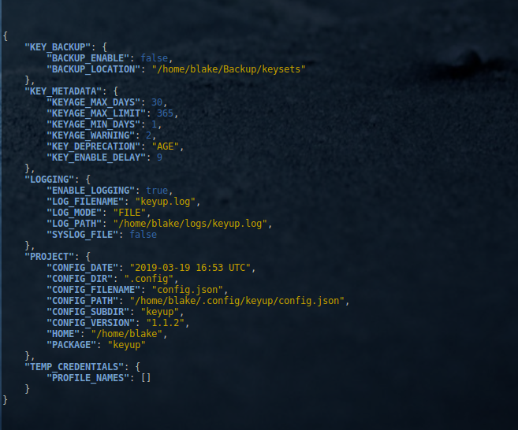

###################################
 Frequently Asked Questions
###################################

.. _Frequently Asked Questions:

:ref:`general`

    - :ref:`QG0`
    - :ref:`QG1`
    - :ref:`QG2`
    - :ref:`QG3`

:ref:`logging`

    - :ref:`QL0`
    - :ref:`QL1`

:ref:`Automated Rotation`

    - :ref:`QA1`
    - :ref:`QA2`

:ref:`misc`

    - :ref:`QM1`

------------

.. _general:

General Questions
^^^^^^^^^^^^^^^^^^

.. _QG0:

**Q**: How do I rotate keys for the default awscli user?
~~~~~~~~~~~~~~~~~~~~~~~~~~~~~~~~~~~~~~~~~~~~~~~~~~~~~~~~~~~~~

**A**: Keys operations are conducted for the IAM user configured for the default profile
    user in the local awscli using the following:

.. code:: bash

    $ keyup --profile default --operation up          # rotate (change out) keys

List keys for the default awscli user: ::

    $ keyup --profile default --operation list        # list key information

Back to :ref:`Frequently Asked Questions` Top

--------------

.. _QG1:

**Q**: Which set of access keys will ``keyup`` replace if my IAM user has 2 sets of keys?
~~~~~~~~~~~~~~~~~~~~~~~~~~~~~~~~~~~~~~~~~~~~~~~~~~~~~~~~~~~~~~~~~~~~~~~~~~~~~~~~~~~~~~~~~~~~~

**Answer**

    | If you have more than one keyset associated with your IAM user, `keyup <https://keyup.readthedocs.io>`__ compares the age of the two keysets in your account.  An IAM user identity  may be associated with a  |faq_link1| at a time.

    Keyup examines the keys associated with your IAM user and replaces the oldest, *active* keyset.

        -  Oldest keys are deprecated
        -  Must be active (enabled)
        -  If only 1 active set of keys, will replace active and leave the inactive keys untouched.

.. |faq_link1| raw:: html

    <a href="https://docs.aws.amazon.com/IAM/latest/UserGuide/reference_iam-limits.html" target="_blank">maximum of 2 sets of iam access keys</a>

Back to :ref:`Frequently Asked Questions` Index

--------------

.. _QG2:

**Q**: How often can I rotate my access keys?  Is there a limit or does Amazon charge me?
~~~~~~~~~~~~~~~~~~~~~~~~~~~~~~~~~~~~~~~~~~~~~~~~~~~~~~~~~~~~~~~~~~~~~~~~~~~~~~~~~~~~~~~~~~~

**A**: There is no (practical) limit to how often you change your access keys.

       Amazon does not charge for issuing new access keys.  IAM Access Keys are a feature
       of every AWS Account.

Back to :ref:`Frequently Asked Questions` Top

--------------

.. _QG3:

**Q**: How do I renew access keys for another IAM user account instead of my own account?
~~~~~~~~~~~~~~~~~~~~~~~~~~~~~~~~~~~~~~~~~~~~~~~~~~~~~~~~~~~~~~~~~~~~~~~~~~~~~~~~~~~~~~~~~~~~~

**A**:  Assuming your IAM user possess elevalated IAM priviledges to create and
        delete access keys for other users, you can rotate keys for another user
        via the following:

.. code:: bash

    $ keyup --profile myIAMuser --user-name JoeUser --operation up

        # myIAMuser:  profile name alias for an IAM user with admin IAM permissions
        # JoeUser:    The IAM user account for which you wish to rotate access keys

Back to :ref:`Frequently Asked Questions` Top

--------------

.. _logging:

Logging & Log Configuration
^^^^^^^^^^^^^^^^^^^^^^^^^^^^

.. _QL0:

**Q**: How do I configure logging for ``keyup``?
~~~~~~~~~~~~~~~~~~~~~~~~~~~~~~~~~~~~~~~~~~~~~~~~~~~~~~~

**A**: Logging is turned off by default for any new installation.

    To turn on logging, start the configure menu via the following command:

.. code:: bash

    $ keyup --configure

Answer 'True' when asked to enable logging.

Next select from one of two options:

    - **SYSLOG**: logging to the system log file (/var/log/syslog)
    - **FILE**: logging to a file you specify

--------------

.. _QL1:

**Q**: Why doesn't ``keyup`` produce any log output?
~~~~~~~~~~~~~~~~~~~~~~~~~~~~~~~~~~~~~~~~~~~~~~~~~~~~~~~

**A**: Logging is turned off by default for any new installation of **keyup**.

    To turn on logging, start the configure menu via the following command:

.. code:: bash

    $ keyup --configure

Answer 'True' when asked to enable logging when answering the guided configuration questions.

To verify logging is enabled in your specific keyup configuration, check that ``ENABLE_LOGGING``
parameter is set to True by viewing the contents of your configuration file with the following command:

.. code:: bash

    $ keyconfig

It should display |link-faq1| syntax similar to below:

.. code-block:: json

    {
        "KEY_BACKUP": {
            "BACKUP_ENABLE": false,
            "BACKUP_LOCATION": "/home/user/Backup/keysets"
        },
        "KEY_METADATA": {
            "KEYAGE_MAX_DAYS": 30,
            "KEYAGE_MAX_LIMIT": 365,
            "KEYAGE_MIN_DAYS": 1,
            "KEYAGE_WARNING": 2,
            "KEY_DEPRECATION": "AGE",
            "KEY_ENABLE_DELAY": 9
        },
        "LOGGING": {
            "ENABLE_LOGGING": true,
            "LOG_FILENAME": "keyup.log",
            "LOG_MODE": "FILE",
            "LOG_PATH": "/home/user/logs/keyup.log",
            "SYSLOG_FILE": false
        },
        "PROJECT": {
            "CONFIG_DATE": "2019-03-19 16:53 UTC",
            "CONFIG_DIR": ".config",
            "CONFIG_FILENAME": "config.json",
            "CONFIG_PATH": "/home/user/.config/keyup/config.json",
            "CONFIG_SUBDIR": "keyup",
            "CONFIG_VERSION": "1.1.2",
            "HOME": "/home/user",
            "PACKAGE": "keyup"
        },
        "TEMP_CREDENTIALS": {
            "PROFILE_NAMES": []
        }
    }

.. |link-faq1| raw:: html

   <a href="https://en.wikipedia.org/wiki/JSON" target="_blank">Javascript Object Notation (json)</a>

Back to :ref:`Frequently Asked Questions` Top

--------------

.. _Automated Rotation:

Automated Key Rotation
^^^^^^^^^^^^^^^^^^^^^^

.. _QA1:

**Q**: How do I automate rotation of access keys for my IAM user?
~~~~~~~~~~~~~~~~~~~~~~~~~~~~~~~~~~~~~~~~~~~~~~~~~~~~~~~~~~~~~~~~~~~~~~

**A**: Use of scheduler is a common simple way to automate AWS access key rotation.

       On Linux, crontab can be setup as follows:

.. code:: bash

    $ crontab -e

Once your users' crontab is open (any scheduler will work), enter the following
to for daily access key rotation @ 0700 hrs every morning:

.. code:: bash

    # keyup auto rotate
    0 7 * * *  keyup --profile johndoe --operation up --auto

The ``--auto`` switch supresses all output to stdout, so ``keyup`` produces no output
to the cli.   Logging output is retained and the only way to troubleshoot any issues while
operating in auto mode; thus, it is highly recommended that you ensure that logging is
enabled and working.

If you haven't enabled logging yet, please see:

    :ref:`QL0`

Verify your crontab entry was saved by issuing:

.. code:: bash

    $ crontab -l

You should see the following output:

.. code:: bash

    # Edit this file to introduce tasks to be run by cron.
    #
    # Each task to run has to be defined through a single line
    # indicating with different fields when the task will be run
    # and what command to run for the task
    #
    # To define the time you can provide concrete values for
    # minute (m), hour (h), day of month (dom), month (mon),
    # and day of week (dow) or use '*' in these fields (for 'any').#
    # Notice that tasks will be started based on the cron's system
    # daemon's notion of time and timezones.

    # keyup auto rotate
    0 7 * * 5  keyup --profile myUser --operation up --auto

Other Crontab Scheduler Examples:
---------------------------------

Weekly Rotation every Sat 10:00 AM:

.. code:: bash

    # weekly
    0 10 * * 6  KEYUP=$(which keyup);  $KEYUP --profile johndoe --operation up --auto

Weekly access key rotation (every Friday) for another IAM user, but using your
account permissions to perform the rotation:

.. code:: bash

    # keyup auto rotate
    0 7 * * 5 keyup --profile myUser  --operation up  --auto

Back to :ref:`Frequently Asked Questions` Top

--------------

.. _QA2:

**Q**: Is it ok to rotate access keys while I have `STS temporary credentials <https://docs.aws.amazon.com/IAM/latest/UserGuide/id_credentials_temp.html>`__ present in my local awscli configuration?
~~~~~~~~~~~~~~~~~~~~~~~~~~~~~~~~~~~~~~~~~~~~~~~~~~~~~~~~~~~~~~~~~~~~~~~~~~~~~~~~~~~~~~~~~~~~~~~~~~~~~~~~~~~~~~~~~~~~~~~~~~~~~~~~~~~~~~~~~~~~~~~~~~~~~~~~~~~~~~~~~~~~~~~~~~~~~~~~~~~~~~~~~~~~~~~~~~~~~~~~~~~~~~~~

**A**: ``keyup`` has special logic to avoid disrupting STS Temporary Credentials if they
       are present in your local awscli configuration.  The following summarizes the
       logic ``keyup`` employs when dealing with temporary credentials:

        - ``keyup`` detects when STS credentials are present in the local credentials files

        - If temporary credentials are detected, ``keyup`` attempts to determine if
          they are active by trying to authenicate to `Amazon STS <https://docs.aws.amazon.com/STS/latest/APIReference/Welcome.html>`__
          using 2 sets of temporary credentials.

        - **If authentication fails**:
          ``keyup`` assumes the temporary credentials are expired and ignores them.
          key rotation proceeds automatically as normal

        - **If authentication succeeds**:
          ``keyup`` assumes the temporary credentials are active and prohibits
          access key rotation.

Back to :ref:`Frequently Asked Questions` Top

--------------

.. _misc:

Miscellaneous Questions
^^^^^^^^^^^^^^^^^^^^^^^^

.. _QM1:

**Q**: How do I know what options are set in my local config file?
~~~~~~~~~~~~~~~~~~~~~~~~~~~~~~~~~~~~~~~~~~~~~~~~~~~~~~~~~~~~~~~~~~~~~

**A**: Call the ``keyconfig`` script.

    You can display ``keyup``'s local configuration file via by calling the console script:

.. code:: bash

    $ keyconfig

--------------

Back to :ref:`Frequently Asked Questions` Top

--------------

`Table Of Contents <./index.html>`__

-----------------

|
