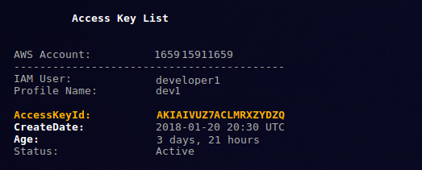
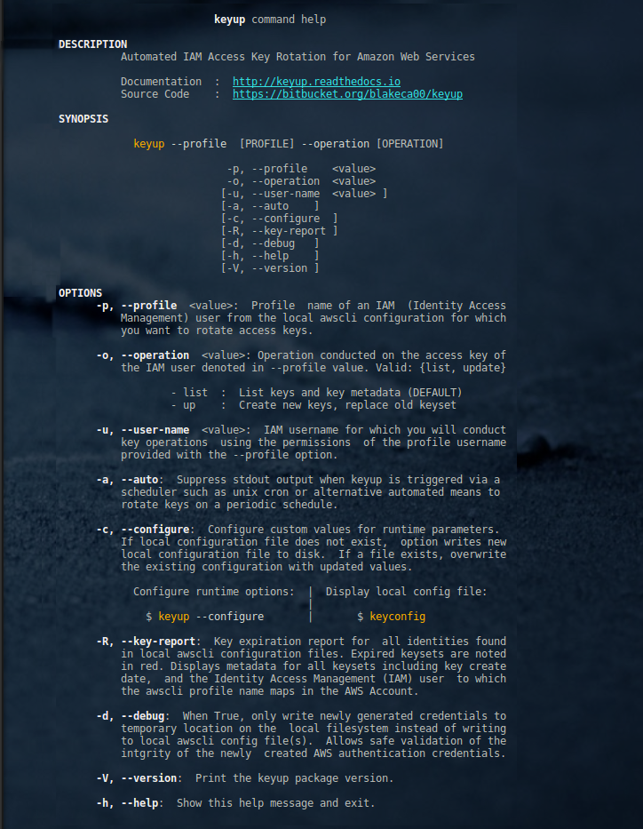

Purpose
--------

``keyup`` automates IAM user access key rotation from the cli by allowing ad hoc or
scheduled renewal of your access key credentials via the Amazon API's.

**keyup**:

    * is a safe and reliable way to rotate (renew) access keys to Amazon Web Services as frequently as you wish, with minimal effort and risk.
    * requires only the profile name of your IAM user in your local `awscli configuration <https://docs.aws.amazon.com/cli/latest/reference/>`__

**Features**:

    * access key rotation via the Amazon APIs
    * key rotation includes:

        * creation of new access keys
        * automated installation in the local `awscli configuration <http://docs.aws.amazon.com/cli/latest/userguide/cli-config-files.html>`__
        * deprecated key deletion

    * automated, unattended key rotation
    * rotate keys as frequently as you wish (daily, for example)

--------------

( back to `Table Of Contents <./index.html>`__ )

--------------------

Getting Started
----------------

Before starting, please take a moment to read the following:

-  `Frequently Asked Questions (FAQ) <./FAQ.html>`__
-  `Use Cases <./usecases.html>`__

**Other Resources**:

-  Source Code: `keyup bitbucket repository <https://bitbucket.org/blakeca00/keyup>`__
-  Amazon `Secure Token Service (STS) <https://docs.aws.amazon.com/STS/latest/APIReference/Welcome.html>`__ Documentation
-  Amazon Web Services' `Command Line Interface (awscli) <https://docs.aws.amazon.com/cli/latest/reference/>`__ Documentation
-  **keyup** `Open Source License Agreement <./license.html>`__

**Current Release**:

-  Ensure you are running the most current release.  See the most :ref:`latest`.

--------------

   ( back to `Table Of Contents <./index.html>`__ )

--------------

.. _Docs:

Documentation
-------------

**Online**:

- Complete html documentation available at `http://keyup.readthedocs.io <http://keyup.readthedocs.io>`__.

**Download**:  Available via download in the formats below

- `pdf format <https://readthedocs.org/projects/keyup/downloads/pdf/latest/>`__
- `Amazon Kindle <https://readthedocs.org/projects/keyup/downloads/epub/latest/>`__ (epub) format

--------------

( back to `Table Of Contents <./index.html>`__ )

--------------------

Parameters & Options
--------------------

Display help menu to see available options and functionality.

.. code:: bash

        $  keyup  --help

--------------

( back to `Table Of Contents <./index.html>`__ )

--------------

Author & Copyright
------------------

All works contained herein copyrighted via below author unless work is
explicitly noted by an alternate author.

.. |year| date:: %Y

-  Copyright 2017-|year| Blake Huber, All Rights Reserved.

**License**

-  Software is licensed under the `GNU General Public License Agreement v3 <./license.html>`__.

--------------

Back to `Table Of Contents <./index.html>`__

-----------------

Disclaimer
----------

*Code is provided "as is". No liability is assumed by either the code's
originating author nor this repo's owner for their use at AWS or any
other facility. Furthermore, running function code at AWS may incur
monetary charges; in some cases, charges may be substantial. Charges are
the sole responsibility of the account holder executing code obtained
from this library.*

Additional terms may be found in the complete `license agreement <./license.html>`__.

--------------

Back to :ref:`purpose` Top

--------------

`Table Of Contents <./index.html>`__

-----------------

|
