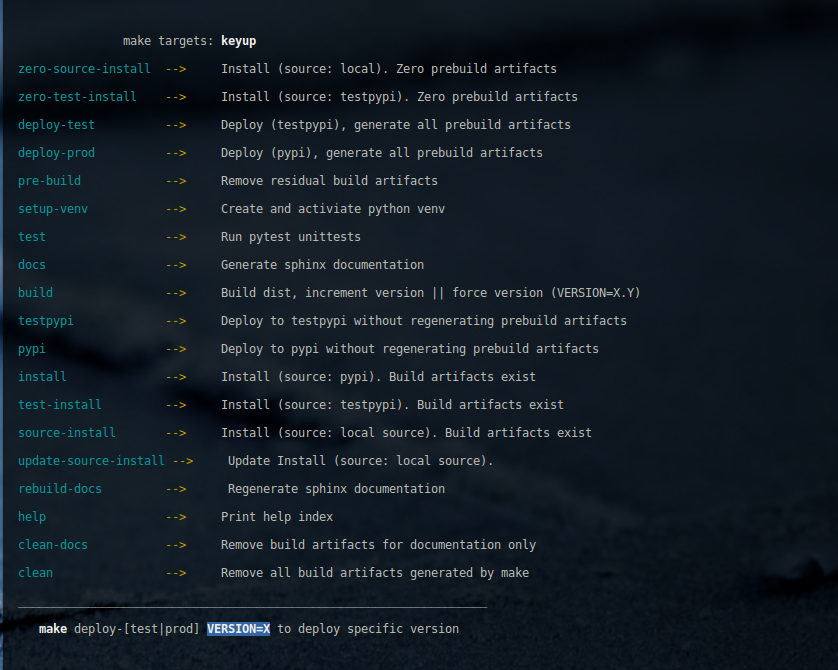
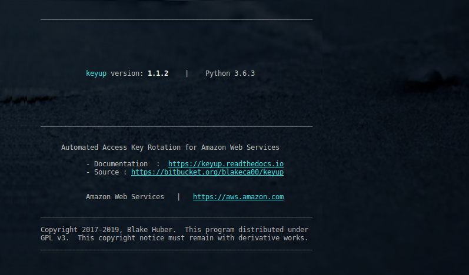

.. _install:

Installation
*************

Choose your operating system for correct installation instructions:

**Linux Distributions**

   - :ref:`redhat`
   - :ref:`ubuntu`
   - :ref:`amazonlinux`

**Windows Distributions**

   - :ref:`windows7`
   - :ref:`windows10`

**Installation via Source**

    - :ref:`source`

**Post-Installation**

    - :ref:`verify`

**Note**
    | - Generally, any modern Linux distribution may work.
    | - `Python 3 <http://www.python.org>`_ supported version *is a hard requirement*.

------------

.. _redhat:

Redhat Enterprise Linux v7.X / Centos 7.X
~~~~~~~~~~~~~~~~~~~~~~~~~~~~~~~~~~~~~~~~~~

-  Install Python3 Package Manager

.. code:: bash

        $ sudo yum install python3-pip

-  Install `awscli <https://github.com/aws/aws-cli/>`__

   Detailed instructions can be found in the README located at:
   https://github.com/aws/aws-cli/

   The easiest method, provided your platform supports it, is via
   `pip <http://www.pip-installer.org/en/latest>`__.

.. code:: bash

        $ pip3 install awscli --user

-  If you have the aws-cli installed and want to upgrade to the latest
   version you can run:

.. code:: bash

        $ pip3 install --upgrade awscli --user

-  Installation via pip3 (python3 packages via pip package manager)

.. code:: bash

        $ pip3 install keyup --user

-  :ref:`verify`

Back to :ref:`install` Table of Contents

------------------

.. _ubuntu:

Ubuntu v16.04+, Ubuntu Variants
~~~~~~~~~~~~~~~~~~~~~~~~~~~~~~~~~

-  Install Python3 Package Manager

.. code:: bash

        $ sudo apt-get install python3-pip

-  Install `awscli <https://github.com/aws/aws-cli/>`__

   Detailed instructions can be found in the README located at:
   https://github.com/aws/aws-cli/

   The easiest method, provided your platform supports it, is via
   `pip <http://www.pip-installer.org/en/latest>`__.

.. code:: bash

        $ pip3 install awscli --user

-  If you have the aws-cli installed and want to upgrade to the latest
   version you can run:

.. code:: bash

        $ pip3 install --upgrade awscli --user

-  Installation via pip3 (python3 packages via pip package manager)

.. code:: bash

        $ pip3 install keyup --user

-  :ref:`verify`

Back to :ref:`install` Table of Contents

------------------

.. _amazonlinux:

Amazon Linux v2016+
~~~~~~~~~~~~~~~~~~~~~

-  Install Python3 Package Manager:

.. code:: bash

        $ sudo yum install python36-pip

        OR

        $ sudo yum install python35-pip / python34-pip    # latest your distribution supports

-  Install keyup:

.. code:: bash

        $ pip3 install keyup --user

-  :ref:`verify`

Back to :ref:`install` Table of Contents

------------------

.. _windows7:

Microsoft Windows 7
~~~~~~~~~~~~~~~~~~~~~

-  Install Python3 by downloading the latest `Python3 version for Windows <https://www.python.org/downloads/windows/>`__

- Install **keyup**:

.. code:: powershell

    $ pip install keyup

-  :ref:`verify`

Back to :ref:`install` Table of Contents

------------------

.. _windows10:

Microsoft Windows 10
~~~~~~~~~~~~~~~~~~~~~

-  Install Python3 by downloading the latest `Python3 version for Windows <https://www.python.org/downloads/windows/>`__

- Install **keyup**:

.. code:: powershell

    $ pip install keyup

-  :ref:`verify`

Back to :ref:`install` Table of Contents

--------------

.. _source:

Build Source Code
~~~~~~~~~~~~~~~~~~~~

To install locally from source code, do the following:

Check out the ``keyup`` code repository:

.. code:: bash

    $ git clone https://blakeca00@bitbucket.org/blakeca00/keyup.git

    $ cd keyup/

Display the list of make targets:

.. code:: bash

    $ make help

To install locally in virtual environment, make the install from source target:

.. code:: bash

    $ make source-install

-  :ref:`verify`

--------------

Post-Installation
*****************

.. _verify:

Verify Your Installation
~~~~~~~~~~~~~~~~~~~~~~~~~~~

.. code:: bash

    $ keyup --version

--------------

Back to :ref:`install` Top

--------------

`Table Of Contents <./index.html>`__

-----------------

|
