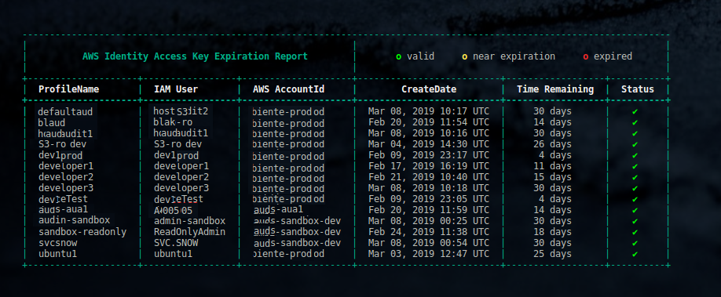
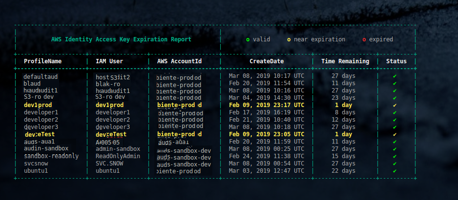
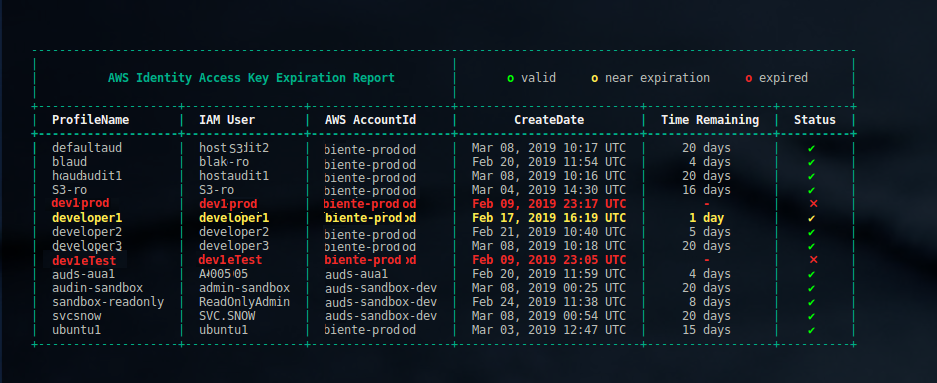

Key Report
^^^^^^^^^^

Overview of keyup's Key Report and required `Identity Access Management (IAM) <https://docs.aws.amazon.com/iam/index.html>`__ permissions.

--------------

Key Report Contents
~~~~~~~~~~~~~~~~~~~~~~~~~~~~

- :ref:`overview`
- :ref:`permissions-req`
- :ref:`permissions-rec`
- :ref:`policy-overview`
- :ref:`examples`

--------------

.. _overview:

Report Overview
~~~~~~~~~~~~~~~~~~~~~~~

``keyup`` provides a parameter to produce a report for all iam users referenced in the local |location_link1| configuration file. The report shows the expired status of all access keys for these users. This is valuable because it allows the user to understand which iam users require renewed access keys without running **keyup** for each iam user account individually.

.. |location_link1| raw:: html

    <a href="https://docs.aws.amazon.com/cli/index.html" target="_blank">awscli</a>

Execute the following command to run the key report for all iam users in the local |location_link2|:

.. |location_link2| raw:: html

    <a href="https://github.com/aws/aws-cli" target="_blank">awscli configuration file</a>

.. code:: bash

        $ keyup --key-report

Back to :ref:`Key Report Contents`

--------------

.. _permissions-req:

Required User Permissions
~~~~~~~~~~~~~~~~~~~~~~~~~~~~~~~~

There are minimal `Identity Access Management (IAM) <https://docs.aws.amazon.com/iam/index.html>`__
permissions required to return valid results for a each IAM user. If an iam user referenced in the local awscli configuration file does not have adequate permissions to return results for the key report, **keyup** will simply skip the user and omit the iam user from the key report.

The following IAM policy must be assigned to each IAM user either via group policy assignment or directly attached to the IAM user identity in the AWS Account.

.. code-block:: json

    {
      "Version": "2012-10-17",
      "Statement": [
        {
          "Action": [
            "iam:ListAccountAliases"
          ],
          "Resource": [
            "arn:aws:iam::000000000000:user/*"
          ],
          "Effect": "Allow",
          "Sid": "iamAccountInfo"
        },
        {
          "Action": [
            "iam:CreateAccessKey",
            "iam:DeleteAccessKey",
            "iam:ListAccessKeys",
            "iam:GetAccessKeyLastUsed"
          ],
          "Resource": [
            "arn:aws:iam::742134111111:user/${aws:username}"
          ],
          "Effect": "Allow",
          "Sid": "iamUserChangeOwnAccessKeys"
        }
      ]
    }

Back to :ref:`Key Report Contents`

--------------

.. _permissions-rec:

Recommended User Permissions
~~~~~~~~~~~~~~~~~~~~~~~~~~~~~~~~~~~

The policy below is highly recommended as a complement to the required IAM permissions policy above. The recommended policy will require a 2-factor MFA code when attempting to provision resources in an AWS Account.

.. code-block:: json

    {
      "Statement": [
        {
          "Action": [
            "iam:ChangePassword",
            "iam:CreateLoginProfile",
            "iam:DeleteLoginProfile",
            "iam:GetAccountPasswordPolicy",
            "iam:GetAccountSummary",
            "iam:GetLoginProfile",
            "iam:UpdateLoginProfile"
          ],
          "Effect": "Allow",
          "Resource": [
            "arn:aws:iam::000000000000:user/${aws:username}"
          ],
          "Sid": "AllowIndividualUserToSeeTheirAccountInformation"
        },
        {
          "Action": [
            "iam:ListVirtualMFADevices",
            "iam:ListMFADevices"
          ],
          "Effect": "Allow",
          "Resource": [
            "arn:aws:iam::000000000000:user/${aws:username}",
            "arn:aws:iam::000000000000:mfa/*"
          ],
          "Sid": "AllowIndividualUserToListTheirMFA"
        },
        {
          "Action": [
            "iam:CreateVirtualMFADevice",
            "iam:DeactivateMFADevice",
            "iam:DeleteVirtualMFADevice",
            "iam:EnableMFADevice",
            "iam:ResyncMFADevice"
          ],
          "Effect": "Allow",
          "Resource": [
            "arn:aws:iam::000000000000:user/${aws:username}",
            "arn:aws:iam::000000000000:mfa/*"
          ],
          "Sid": "AllowIndividualUserToManageThierMFA"
        },
        {
          "Condition": {
            "Null": {
              "aws:MultiFactorAuthAge": "true"
            }
          },
          "Effect": "Deny",
          "NotAction": "iam:*",
          "Resource": "*",
          "Sid": "DoNotAllowAnythingOtherThanAboveUnlessMFAd"
        }
      ],
      "Version": "2012-10-17"
    }

Back to :ref:`Key Report Contents`

--------------

.. _policy-overview:

Policies Explained
~~~~~~~~~~~~~~~~~~~

See the :ref:`IAM Policy Details` section to gain an understanding of each each IAM policy provision and the permissions granted to a user.

Back to :ref:`Key Report Contents`

--------------

.. _examples:

Screenshots
~~~~~~~~~~~~~~~~~~~~~~~~~~~

Sample key report screenshots (click to enlarge).

* Key report showing all users with valid access keys (none expired):

* Key report showing keys within 48 hours of expiration:

* Key report showing expired keys:

--------------

Back to :ref:`Key Report Contents` Top

--------------

`Table Of Contents <./index.html>`__

-----------------

|
