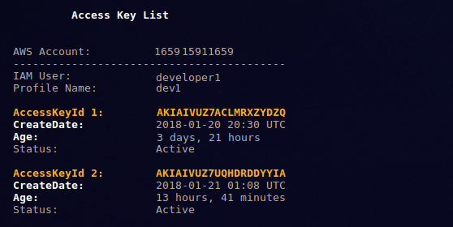
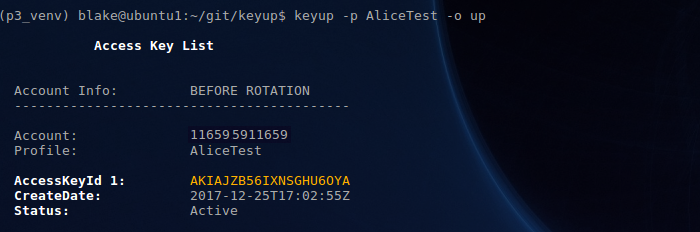
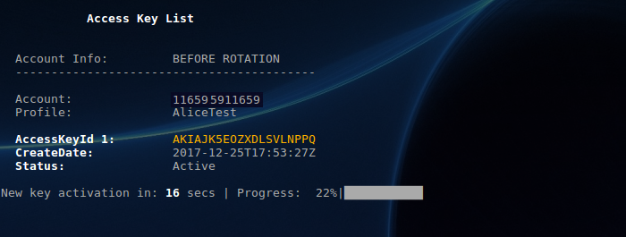
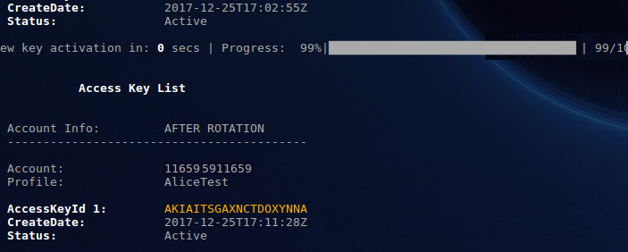
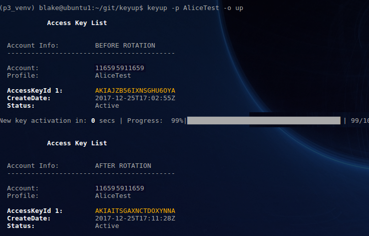

Use Cases
^^^^^^^^^^

3 Main Use Cases for keyup:

- :ref:`list-keys`
- :ref:`rotate-keys-manual`
- :ref:`rotate-keys-auto`

--------------

.. _list-keys:

List Access Keys
~~~~~~~~~~~~~~~~~

Display access keys for a specific IAM user in an AWS Account.

.. code:: bash

        $ keyup --profile [PROFILE] --operation list

``[PROFILE]``:

    * awscli profile name profile from the local awscli config
    * IAM user for whom you wish to conduct key operations

``list``:

    * list operation, lists key information for the profile username given in PROFILE.
    * Prints report showing access key id, key age (time since creation), and status (active or inactive)

--------------

.. _rotate-keys-manual:

Rotate Keys (User-Initiated)
~~~~~~~~~~~~~~~~~~~~~~~~~~~~~

Attended mode, manual operation run from cli. Operator can enter MFA
code if required

.. code:: bash

        $ keyup --profile [PROFILE] --operation up

``[PROFILE]``:

    * awscli profile name profile from the local awscli config
    * IAM user for whom you wish to conduct key operations

``up``:

    * update (rotate, or renew) key operation.
    * Creates new access keyset (access key, secret key), installs keys, delete old keys from AWS
    * Short for ``keyup``, which can also be used

**Rotate Keys** output (click below to enlarge imges)

(1) Initiate access key rotation ('up'). Displays access keys for user
    prior to key renewal:

(2) Progress during key renewal:

(3) Display access keys after key rotation showing new keyset generated:

(4) End-to-end cli view of the user-initiated key rotation process:

--------------

.. _rotate-keys-auto:

Rotate Keys (Automated)
~~~~~~~~~~~~~~~~~~~~~~~~

Automated rotation of access keys; typically executed via cron or
similar scheduling mechanism

.. code:: bash

        $ keyup --profile [PROFILE] --operation up --auto

``[PROFILE]``:

    * profile from the local awscli config that is the IAM user for whom you wish to keyup

``up``:

    * up: create new access keys, install them, delete old keys from AWS

``--auto``:

    * For use when calling keyup from an automated scheduler or other programmatic execution mechanism.
    * Flag suppresses all stdout output
    * Log output to the filesystem is retained.

--------------

Back to :ref:`use cases` Top

--------------

`Table Of Contents <./index.html>`__

-----------------

|
